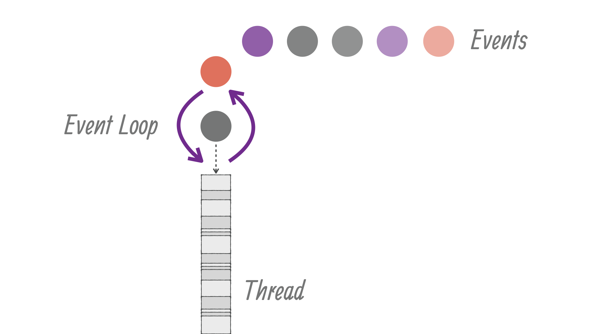
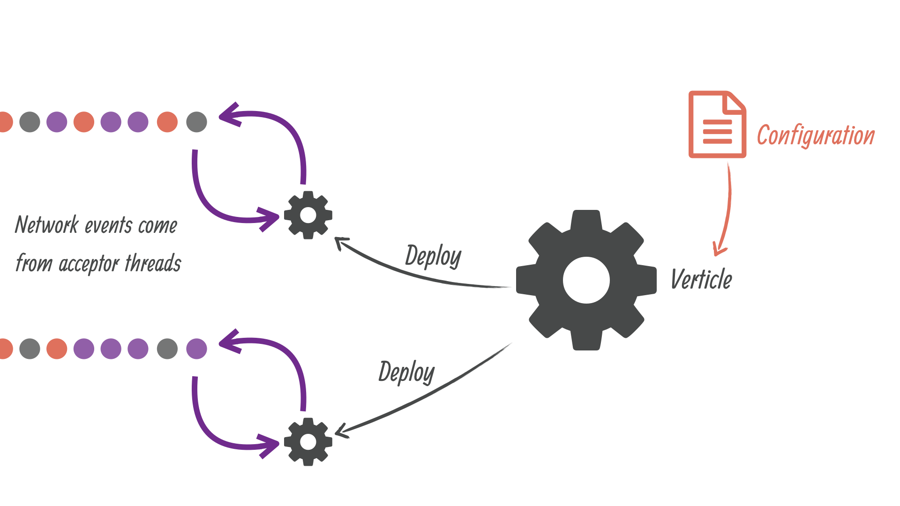
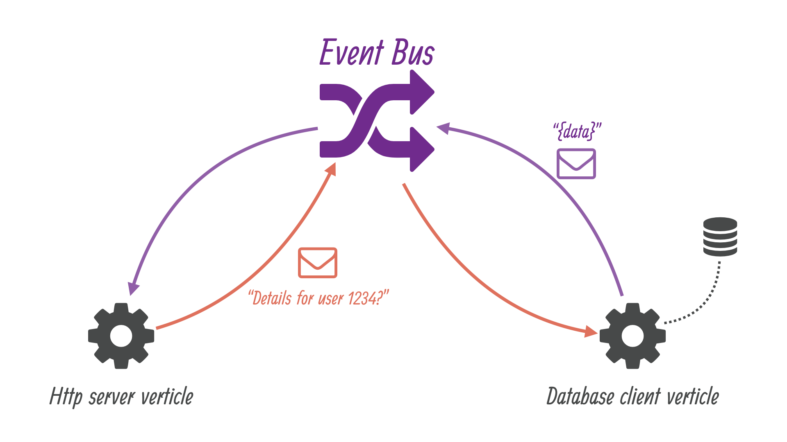

= Introduction

== About this guide

This guide is a gentle introduction to asynchronous programming with Vert.x, primarily aimed at developers familiar with mainstream non-asynchronous web development frameworks and libraries (e.g., Java EE, Spring).
We assume that the reader is familiar with the Java programming language and its ecosystem.

We will start from a wiki web application backed by a relational database and server-side rendering of pages; then we will evolve the application through several steps until it becomes a modern single-page application with "real-time".footnote:[Note that the widespread usage of the term "real-time" in the context of web technologies shall not be confused with _hard_ or _soft_ real-time in specialized operating systems.] web features.
Along the way you will learn to:

1. Design a web application with server-side rendering of pages through templates, and using a relational database for persisting data.
2. Cleanly isolate each technical component as a reusable event processing unit called a _verticle_.
3. Extract Vert.x services for facilitating the design of verticles that communicate with each other seamlessly both within the same JVM process or among distributed nodes in a cluster.
4. Testing code with asynchronous operations.
5. Integrating with third-party services exposing a HTTP/JSON web API.
6. Exposing a HTTP/JSON web API.
7. Securing and controlling access using HTTPS, user authentication for web browser sessions and JWT tokens for third-party client applications.
8. Refactoring some code to use reactive programming with the popular RxJava library and its Vert.x integration.
9. Client-side programming of a single-page application with AngularJS.
10. Real-time web programming using the unified Vert.x event bus integration over SockJS.

== What is Vert.x?

[quote, Vert.x website]
Eclipse Vert.x is a toolkit for building reactive applications on the JVM.

Eclipse Vert.x (which we will just call _Vert.x_ in the remainder of this document) is an opensource project at the Eclipse Foundation.
Vert.x was initiated in 2012 by Tim Fox.

Vert.x is not a framework but a toolkit: the core library defines the fundamental APIs for writing asynchronous networked applications, and then you can pick the useful modules for your application (e.g., database connection, monitoring, authentication, logging, service discovery, clustering support, etc).
Vert.x is based on the http://netty.io/[Netty project], a high-performance asynchronous networking library for the JVM.
Vert.x will let you access the Netty internals _if need be_, but in general you will better benefit from the higher-level APIs that Vert.x provides while not sacrificing performance compared to _raw_ Netty.

Vert.x does not impose any packaging or build environment.
Since Vert.x core itself is just a regular Jar library it can be embedded inside applications packaged as a set of Jars, a single Jar with all dependencies, or it can even be deployed inside popular component and application containers.

Because Vert.x was designed for asynchronous communications it can deal with more concurrent network connections with less threads than synchronous APIs such as Java servlets or `java.net` socket classes.
Vert.x is useful for a large range of applications: high volume message / event processing, micro-services, API gateways, HTTP APIs for mobile applications, etc.
Vert.x and its ecosystem provide all sorts of technical tools for building end-to-end reactive applications.

While it may sound like Vert.x is only useful for demanding applications, the present guide also states that Vert.x works very well for more traditional web applications.
As we will see, the code will remain relatively easy to comprehend, but if the application needs to face a sudden peak in traffic then the code is already written with the essential ingredient for scaling up: _asynchronous processing of events_.

Finally, it is worth mentioning that Vert.x is _polyglot_ as it supports a wide range of popular JVM languages: Java, Groovy, Scala, Kotlin, JavaScript, Ruby and Ceylon.
The goal when supporting a language in Vert.x is not just to provide access to the APIs, but also to make sure that the language-specific APIs are idiomatic in each target language (e.g., using Scala futures in place of Vert.x futures).
It is well-possible to develop different technical parts of a Vert.x application using different JVM languages.

== Core Vert.x concepts

There are 2 key concepts to learn in Vert.x:

1. what a _verticle_ is, and
2. how the _event bus_ allows verticles to communicate.

=== Threading and programming models

The unit of deployment in Vert.x is called a _Verticle_.
A verticle processes incoming events over an _event-loop_, where events can be anything like receiving network buffers, timing events, or messages sent by other verticles.
Event-loops are typical in asynchronous programming models: 

Each event shall be processed in a _reasonable_ amount of time to not block the event loop.
This means that _thread blocking_ operations shall not be performed while executed on the event loop, exactly like processing events in a graphical user interface (e.g., freezing a Java / Swing interface by doing a slow network request).
As we will see later in this guide, Vert.x offers mechanisms to deal with blocking operations outside of the event loop.
In any case Vert.x emits warnings in logs when the event loop has been processing an event for _too long_, which is also configurable to match application-specific requirements (e.g., when working on slower IoT ARM boards).

Every event loop is attached to a thread.
By default Vert.x attaches 2 event loops per CPU core thread.
The direct consequence is that a regular verticle always processes events on the same thread, so there is no need to use thread coordination mechanisms to manipulate a verticle state (e.g, Java class fields).

A verticle can be passed some configuration (e.g., credentials, network addresses, etc) and a verticle can be deployed several times:

Incoming network data are being received from accepting threads then passed as events to the corresponding verticles.
When a verticle opens a network server and is deployed more than once, then the events are being distributed to the verticle instances in a round-robin fashion which is very useful for maximizing CPU usage with lots of concurrent networked requests.
Finally, verticles have a simple start / stop life-cycle, and verticles can deploy other verticles.

=== Event bus 

Verticles form technical units of deployments of code in Vert.x.
The Vert.x _event bus_ is the main tool for different verticles to communicate through asynchronous message passing.
For instance suppose that we have a verticle for dealing with HTTP requests, and a verticle for managing access to the database.
The event bus allows the HTTP verticle to send a request to the database verticle that performs a SQL query, and responds back to the HTTP verticle:

The event-bus allows passing any kind of data, although JSON is the preferred exchange format since it allows verticles written in different languages to communicate, and more generally JSON is a popular general-purpose semi-structured data marshaling text format.

Message can be sent to _destinations_ which are free-form strings.
The event bus supports the following communication patterns:

1. point-to-point messaging, and
2. request-response messaging and
3. publish / subscribe for broadcasting messages.

The event bus allows verticles to transparently communicate not just within the same JVM process:

* when network clustering is activated, the event bus is _distributed_ so that messages can be sent to verticles running on other application nodes,
* the event-bus can be accessed through a simple TCP protocol for third-party applications to communicate,
* the event-bus can also be exposed over general-purpose messaging bridges (e.g, AMQP, Stomp),
* a SockJS bridge allows web applications to seamlessly communicate over the event bus from JavaScript running in the browser by receiving and publishing messages just like any verticle would do.
