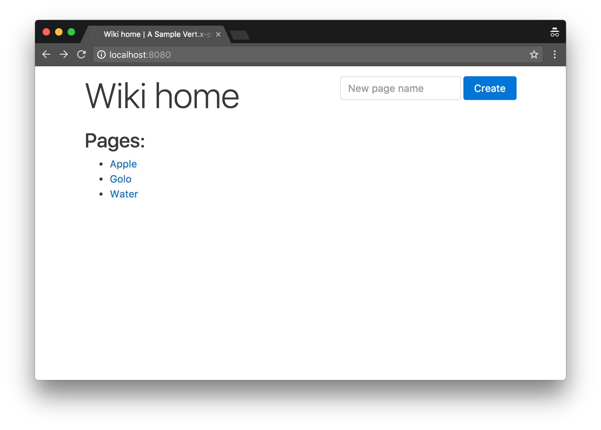
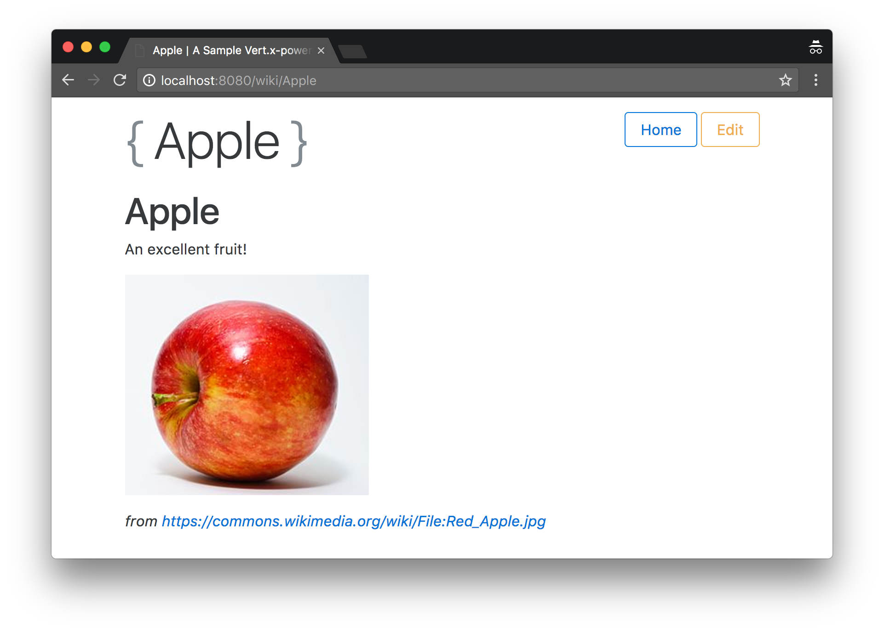
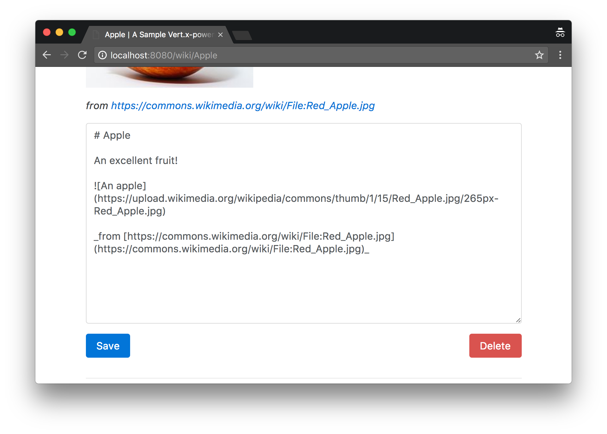

= A minimally viable wiki written with Vert.x

TIP: The corresponding source code is in the `step-1` folder of the guide repository.

We are going to start with a first iteration and the simplest code possible to have a wiki written with Vert.x.
While the next iterations will introduce more elegance into the code base as well as proper testing, we will see that quick prototyping with Vert.x is both a simple and a realistic target.

At this stage the wiki will use server-side rendering of HTML pages and data persistence through a JDBC connection.
To do so, we will use the following libraries.

1. http://vertx.io/docs/vertx-web/java/[Vert.x web] as while the Vert.x core library _does_ support the creation of HTTP servers, it does not provide elegant APIs to deal with routing, handling of request payloads, etc.
2. http://vertx.io/docs/vertx-jdbc-client/java/[Vert.x JDBC client] to provide an asynchronous API over JDBC.
3. http://freemarker.org/[Apache FreeMarker] to render server-side pages as it is an uncomplicated template engine.
4. https://github.com/rjeschke/txtmark[Txtmark] to render Markdown text to HTML, allowing the edition of wiki pages in Markdown.

== Bootstrapping a Maven project

This guide makes the choice of using https://maven.apache.org[Apache Maven] as the build tool, primarily because it is very well integrated with the major integrated development environments.
You can equally use another build tool such as https://gradle.org/[Gradle].

The Vert.x community offers a template project structure from https://github.com/vert-x3/vertx-maven-starter that can be cloned.
Since you will likely want to use (Git) version control as well, the fastest route is to clone the repository, delete its `.git/` folder and then create a new Git repository:

    git clone https://github.com/vert-x3/vertx-maven-starter.git vertx-wiki
    cd vertx-wiki
    rm -rf .git
    git init

The project offers a sample verticle as well as a unit test.
You can safely delete all `.java` files beneath `src/` to hack on the wiki, but before doing so you may test that the project builds and runs successfully:

    mvn package exec:java

You will notice that the Maven project `pom.xml` does 2 interesting things:

1. it uses the https://maven.apache.org/plugins/maven-shade-plugin/[Maven Shade Plugin] to create a single Jar archive with all required dependencies, suffixed by `-fat.jar`, also called _"a fat Jar"_, and
2. it uses the http://www.mojohaus.org/exec-maven-plugin/[Exec Maven Plugin] to provide the `exec:java` goal that in turns starts the application through the Vert.x `io.vertx.core.Launcher` class. This is actually equivalent to running using the `vertx` command-line tool that ships in the Vert.x distribution.

Finally, you will notice the presence of the `redeploy.sh` and `redeploy.bat` scripts that you can alternatively use for automatic compilation and redeployment upon code changes.
Note that doing so requires ensuring that the `VERTICLE` variable in these scripts matches the main verticle to be used.

[NOTE]
====
Alternatively, the Fabric8 project hosts https://vmp.fabric8.io/[a Vert.x Maven plugin].
It has goals to initialize, build, package and run a Vert.x project.

To generate a similar project as by cloning the Git starter repository:

    mkdir vertx-wiki
    cd vertx-wiki
    mvn io.fabric8:vertx-maven-plugin:1.0.13:setup -DvertxVersion=3.8.2
    git init

====

== Adding the required dependencies

The first batch of dependencies to add to the Maven `pom.xml` file are those for the web processing and rendering:

[source,xml,indent=0]
----
include::pom.xml[tags=web-deps]
----

TIP: As the `vertx-web-templ-freemarker` name suggests, Vert.x web provides pluggable support for popular template engines: Handlebars, Jade, MVEL, Pebble, Thymeleaf and of course Freemarker.

The second set of dependencies are those required for JDBC database access:

[source,xml,indent=0]
----
include::pom.xml[tags=db-deps]
----

The Vert.x JDBC client library provides access to any JDBC-compliant database, but of course our project needs to have a JDBC driver on the _classpath_.

http://hsqldb.org/[HSQLDB] is well-known relational database that is written in Java.
It is quite popular when used as an embedded database to avoid the requirement of having a third-party database server running separately.
It is also popular for unit and integration testing as it offers a (volatile) in-memory storage.

HSQLDB as an embedded database is a good fit to get us started.
It stores data in local files, and since the HSQLDB library Jar provides a JDBC driver the Vert.x JDBC configuration will be straightforward.

[NOTE]
====
Vert.x also offers dedicated http://vertx.io/docs/vertx-mysql-postgresql-client/java/[MySQL and PostgreSQL client] libraries.

Of course you can use the general-purpose Vert.x JDBC client to connect to MySQL or PostgreSQL databases, but these libraries offers better performance by working with these 2 database server network protocols rather than going through the (blocking) JDBC APIs.
====

NOTE: Vert.x also provides libraries to deal with the popular non-relational databases http://vertx.io/docs/vertx-mongo-client/java/[MongoDB] and http://vertx.io/docs/vertx-redis-client/java/[Redis].
The larger community offers integration with other storage systems like Apache Cassandra, OrientDB or ElasticSearch.

== Anatomy of a verticle

The verticle for our wiki consists of a single `io.vertx.guides.wiki.MainVerticle` Java class.
This class extends `io.vertx.core.AbstractVerticle`, the base class for verticles that mainly provides:

1. life-cycle `start` and `stop` methods to override,
2. a _protected_ field called `vertx` that references the Vert.x environment where the verticle is being deployed,
3. an accessor to some configuration object that allows passing external configuration to a verticle.

To get started our verticle can just override the `start` method as follows:

[source,java]
----
public class MainVerticle extends AbstractVerticle {

  @Override
  public void start(Promise<Void> promise) {
    promise.complete();
  }
}
----

There are 2 forms of `start` (and `stop`) methods: 1 with no argument and 1 with a _promise_ object reference.
The no-argument variants imply that the verticle initialization or house-keeping phases always succeed unless an exception is being thrown.
The variants with a _promise_ object provide a more fine-grained approach to _eventually_ signal that operations succeeded or not.
Indeed, some initialization or cleanup code may require asynchronous operations, so reporting via a _promise_ object naturally fits with asynchronous idioms.

NOTE: A promise has a `future()` method which eventually holds the result of an asynchronous operation.

== A word on Vert.x promise / future objects and callbacks

Vert.x futures are not JDK futures: they can be composed and queried in a non-blocking fashion.
They shall be used for simple coordination of asynchronous tasks, and especially those of deploying verticles and checking if they were successfully deployed or not.

The Vert.x core APIs are based on callbacks to notify of asynchronous events.
The seasoned developer will naturally think that this opens the door to the so-called _"callback hell"_ where multiple levels of nested callbacks render the code difficult to comprehend as illustrated by this fictional code:

[source,java]
----
foo.a(1, res1 -> {
  if (res1.succeeded()) {
    bar.b("abc", 1, res2 -> {
      if (res.succeeded()) {
         baz.c(res3 -> {
           dosomething(res1, res2, res3, res4 -> {
               // (...)
           });
         });
      }
    });
  }
});
----

While the core APIs could have been designed to favor promises and futures, the choice of callbacks as the cardinal model is actually interesting since it allows different programming abstractions to be used.
Vert.x is a largely un-opinionated project, and callbacks allow the implementation of different models that better cope with asynchronous programming: reactive extensions (via RxJava), promises and futures, fibers (using bytecode instrumentation), etc.

Since all Vert.x APIs are callback-oriented before other abstractions like RxJava can be leveraged, this guide only uses callbacks in the first sections to ensure that the reader gets familiar with the core concepts in Vert.x.
It is also arguably easier to start with callbacks to draw a line between the many sections of asynchronous code.
Once it becomes evident in the sample code that callbacks do not always lead to easily readable code, we will introduce the RxJava support to show how the same asynchronous code can be better expressed by thinking in streams of processed events.

== Wiki verticle initialization phases

To get our wiki running, we need to perform a 2-phases initialization:

1. we need to establish a JDBC database connection, and also make sure that the database schema is in place, and
2. we need to start a HTTP server for the web application.

Each phase can fail (e.g., the HTTP server TCP port is already being used), and they should not run in parallel as the web application code first needs the database access to work.

To make our code _cleaner_ we will define 1 method per phase, and adopt a pattern of returning a _future_ object to notify when each of the phases completes, and whether it did so successfully or not:

[source,java]
----
private Future<Void> prepareDatabase() {
  Promise<Void> promise = Promise.promise();
  // (...)
  return promise.future();
}

private Future<Void> startHttpServer() {
  Promise<Void> promise = Promise.promise();
  // (...)
  return promise.future();
}
----

By having each method returning a _future_ object, the implementation of the `start` method becomes a composition:

[source,java,indent=0]
----
include::src/main/java/io/vertx/guides/wiki/MainVerticle.java[tags=start]
----

When the _future_ of `prepareDatabase` completes successfully, then `startHttpServer` is called and the `steps` future completes depending of the outcome of the future returned by `startHttpServer`.
`startHttpServer` is never called if `prepareDatabase` encounters an error, in which case the `steps` _future_ is in a _failed_ state and becomes completed with the exception describing the error.

Eventually `steps` completes: `setHandler` defines a handler to be called upon completion.
In our case we simply want to complete `startFuture` with `steps` and use the `completer` method to obtain a handler.
This is equivalent to:

[source,java,indent=0]
----
include::src/main/java/io/vertx/guides/wiki/MainVerticle.java[tags=another-start]
----
<1> `ar` is of type `AsyncResult<Void>`.
`AsyncResult<T>` is used to pass the result of an asynchronous processing and may either yield a value of type `T` on success or a failure exception if the processing failed.

=== Database initialization

The wiki database schema consists of a single table `Pages` with the following columns:

[options="header"]
|===
|Column |Type |Description

|`Id`
|Integer
|Primary key

|`Name`
|Characters
|Name of a wiki page, must be unique

|`Content`
|Text
|Markdown text of a wiki page
|===

The database operations will be typical _create, read, update, delete_ operations.
To get us started, we simply store the corresponding SQL queries as static fields of the `MainVerticle` class.
Note that they are written in a SQL dialect that HSQLDB understands, but that other relational databases may not necessarily support:

[source,java,indent=0]
----
include::src/main/java/io/vertx/guides/wiki/MainVerticle.java[tags=sql-fields]
----
<1> The `?` in the queries are placeholders to pass data when executing queries, and the Vert.x JDBC client prevents from SQL injections.

The application verticle needs to keep a reference to a `JDBCClient` object (from the `io.vertx.ext.jdbc` package) that serves as the connection to the database.
We do so using a field in `MainVerticle`, and we also create a general-purpose logger from the `org.slf4j` package:

[source,java,indent=0]
----
include::src/main/java/io/vertx/guides/wiki/MainVerticle.java[tags=db-and-logger]
----

Last but not least, here is the complete implementation of the `prepareDatabase` method.
It attempts to obtain a JDBC client connection, then performs a SQL query to create the `Pages` table unless it already exists:

[source,java,indent=0]
----
include::src/main/java/io/vertx/guides/wiki/MainVerticle.java[tags=prepareDatabase]
----
<1> `createShared` creates a shared connection to be shared among verticles known to the `vertx` instance, which in general is a good thing.
<2> The JDBC client connection is made by passing a Vert.x JSON object. Here `url` is the JDBC URL.
<3> Just like `url`, `driver_class` is specific to the JDBC driver being used and points to the driver class.
<4> `max_pool_size` is the number of concurrent connections. We chose 30 here, but it is just an arbitrary number.
<5> Getting a connection is an asynchronous operation that gives us an `AsyncResult<SQLConnection>`. It must then be tested to see if the connection could be established or not (`AsyncResult` is actually a super-interface of `Future`).
<6> If the SQL connection could not be obtained, then the method _future_ is completed to fail with the `AsyncResult`-provided exception via the `cause` method.
<7> The `SQLConnection` is the result of the successful `AsyncResult`. We can use it to perform a SQL query.
<8> Before checking whether the SQL query succeeded or not, we must release it by calling `close`, otherwise the JDBC client connection pool can eventually drain.
<9> We complete the method _future_ object with a success.

TIP: The SQL database modules supported by the Vert.x project do not currently offer anything beyond passing SQL queries (e.g., an object-relational mapper) as they focus on providing asynchronous access to databases.
However, nothing forbids using https://github.com/vert-x3/vertx-awesome[more advanced modules from the community], and we especially recommend checking out projects like https://github.com/jklingsporn/vertx-jooq[this jOOq generator for Vert.x] or https://github.com/BraintagsGmbH/vertx-pojo-mapper[this POJO mapper].

=== Notes about logging

The previous subsection introduced a logger, and we opted for the https://www.slf4j.org/[SLF4J library].
Vert.x is also unopinionated on logging: you can choose any popular Java logging library.
We recommend SLF4J since it is a popular logging abstraction and unification library in the Java ecosystem.

We also recommend using https://logback.qos.ch/[Logback] as a logger implementation.
Integrating both SLF4J and Logback can be done by adding two dependencies, or just `logback-classic` that points to both libraries (incidentally they are from the same author):

[source,xml,indent=0]
----
include::pom.xml[tags=logger]
----

By default SLF4J outputs many log events to the console from Vert.x, Netty, C3PO and the wiki application.
We can reduce the verbosity by adding the a `src/main/resources/logback.xml` configuration file (see https://logback.qos.ch/ for more details):

[source,xml,indent=0]
----
include::src/main/resources/logback.xml[tags=conf]
----

Last but not least HSQLDB does not integrate well with loggers when embedded.
By default it tries to reconfigure the logging system in place, so we need to disable it by passing a `-Dhsqldb.reconfig_logging=false` property to the Java Virtual Machine when executing applications.

=== HTTP server initialization

The HTTP server makes use of the `vertx-web` project to easily define _dispatching routes_ for incoming HTTP requests.
Indeed, the Vert.x core API allows to start HTTP servers and listen for incoming connections, but it does not provide any facility to, say, have different handlers depending on the requested URL or processing request bodies.
This is the role of a _router_ as it dispatches requests to different processing handlers depending on the URL, the HTTP method, etc.

The initialization consists in setting up a _request router_, then starting the HTTP server:

[source,java,indent=0]
----
include::src/main/java/io/vertx/guides/wiki/MainVerticle.java[tags=startHttpServer]
----
<1> The `vertx` context object provides methods to create HTTP servers, clients, TCP/UDP servers and clients, etc.
<2> The `Router` class comes from `vertx-web`: `io.vertx.ext.web.Router`.
<3> Routes have their own handlers, and they can be defined by URL and/or by HTTP method. For short handlers a Java lambda is an option, but for more elaborate handlers it is a good idea to reference private methods instead. Note that URLs can be parametric: `/wiki/:page` will match a request like `/wiki/Hello`, in which case a `page` parameter will be available with value `Hello`.
<4> This makes all HTTP POST requests go through a first handler, here `io.vertx.ext.web.handler.BodyHandler`. This handler automatically decodes the body from the HTTP requests (e.g., form submissions), which can then be manipulated as Vert.x buffer objects.
<5> The router object can be used as a HTTP server handler, which then dispatches to other handlers as defined above.
<6> Starting a HTTP server is an asynchronous operation, so an `AsyncResult<HttpServer>` needs to be checked for success. By the way the `8080` parameter specifies the TCP port to be used by the server.

== HTTP router handlers

The HTTP router instance of the `startHttpServer` method points to different handlers based on URL patterns and HTTP methods.
Each handler deals with an HTTP request, performs a database query, and renders HTML from a FreeMarker template.

=== Index page handler

The index page provides a list of pointers to all wiki entries and a field to create a new one:

The implementation is a straightforward `select *` SQL query where data is then passed to the FreeMarker engine to render the HTML response.

The `indexHandler` method code is as follows:

[source,java,indent=0]
----
include::src/main/java/io/vertx/guides/wiki/MainVerticle.java[tags=indexHandler]
----
<1> SQL query results are being returned as instances of `JsonArray` and `JsonObject`.
<2> The `RoutingContext` instance can be used to put arbitrary key / value data that is then available from templates, or chained router handlers.
<3> Rendering a template is an asynchronous operation that leads us to the usual `AsyncResult` handling pattern.
<4> The `AsyncResult` contains the template rendering as a `String` in case of success, and we can end the HTTP response stream with the value.
<5> In case of failure the `fail` method from `RoutingContext` provides a sensible way to return a HTTP 500 error to the HTTP client.

FreeMarker templates shall be placed in the `src/main/resources/templates` folder.
The `index.ftl` template code is as follows:

[source,html]
----
include::src/main/resources/templates/index.ftl[]
----

Key / value data stored in the `RoutingContext` object is made available as FreeMarker variable.

Since lots of templates have common header and footers, we extracted the following code in `header.ftl` and `footer.ftl`:

.`header.ftl`
[source,html]
----
include::src/main/resources/templates/header.ftl[]
----

.`footer.ftl`
[source,html]
----
include::src/main/resources/templates/footer.ftl[]
----

=== Wiki page rendering handler

This handler deals with HTTP GET requests to have wiki pages being rendered, as in:

The page also provides a button to edit the content in Markdown.
Instead of having a separate handler and template, we simply rely on JavaScript and CSS to toggle the editor on and off when the button is being clicked:

The `pageRenderingHandler` method code is the following:

[source,java,indent=0]
----
include::src/main/java/io/vertx/guides/wiki/MainVerticle.java[tags=pageRenderingHandler]
----
<1> URL parameters (`/wiki/:page` here) can be accessed through the context request object.
<2> Passing argument values to SQL queries is done using a `JsonArray`, with the elements in order of the `?` symbols in the SQL query.
<3> The `Processor` class comes from the _txtmark_ Markdown rendering library that we use.

The `page.ftl` FreeMarker template code is as follows:

[source,html]
----
include::src/main/resources/templates/page.ftl[]
----

=== Page creation handler

The index page offers a field to create a new page, and its surrounding HTML form points to a URL that is being managed by this handler.
The strategy isn't actually to create a new entry in the database, but simply to redirect to a wiki page URL with the name to create.
Since the wiki page doesn't exist, the `pageRenderingHandler` method will use a default text for new pages, and a user can eventually create that page by editing and then saving it.

The handler is the `pageCreateHandler` method, and its implementation is a redirection through an HTTP 303 status code:

[source,java,indent=0]
----
include::src/main/java/io/vertx/guides/wiki/MainVerticle.java[tags=pageCreateHandler]
----

=== Page saving handler

The `pageUpdateHandler` method deals with HTTP POST requests when saving a wiki page.
This happens both when updating an existing page (issuing a SQL `update` query) or saving a new page (issuing a SQL `insert` query):

[source,java,indent=0]
----
include::src/main/java/io/vertx/guides/wiki/MainVerticle.java[tags=pageUpdateHandler]
----
<1> Form parameters sent through a HTTP POST request are available from the `RoutingContext` object. Note that without a `BodyHandler` within the `Router` configuration chain these values would not be available, and the form submission payload would need to be manually decoded from the HTTP POST request payload.
<2> We rely on a hidden form field rendered in the `page.ftl` FreeMarker template to know if we are updating an existing page or saving a new page.
<3> Again, preparing the SQL query with parameters uses a `JsonArray` to pass values.
<4> The `updateWithParams` method is used for `insert` / `update` / `delete` SQL queries.
<5> Upon success, we simply redirect to the page that has been edited.

=== Page deletion handler

The implementation of the `pageDeletionHandler` method is straightforward: given a wiki entry identifier, it issues a `delete` SQL query then redirects to the wiki index page:

[source,java,indent=0]
----
include::src/main/java/io/vertx/guides/wiki/MainVerticle.java[tags=pageDeletionHandler]
----

== Running the application

At this stage we have a working, self-contained wiki application.

To run it we first need to build it with Maven:

    $ mvn clean package

Since the build produces a Jar with all required dependencies embedded (including Vert.x and a JDBC database), running the wiki is as simple as:

    $ java -jar target/wiki-step-1-1.3.0-SNAPSHOT-fat.jar

You can then point your favorite web browser to http://localhost:8080/ and enjoy using the wiki.
