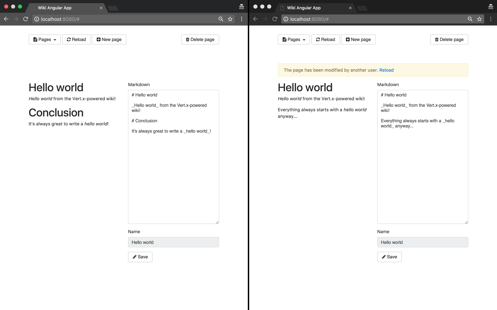

= Real-time web features using cross-border messaging over the event bus

TIP: The corresponding source code is in the `step-10` folder of the guide repository.

Earlier in this guide we saw the event bus in action for verticles to communicate using message-passing inside Vert.x applications.
The developer only has to register a consumer to receive messages and sending / publishing messages.

The SockJS event bus bridge extends these capabilities to the client-side, in the web browser.
It creates a distributed event bus which not only spans multiple Vert.x instances in a cluster, but also includes client-side JavaScript running in (many) browsers.
We can therefore create a huge distributed event bus encompassing many browsers and servers, resulting in a consistent message-based programming model across all constituents of a distributed application.

In this chapter, we will modify the code from `step-9` so that:

* the Markdown content to be rendered is sent to the server without creating new HTTP requests, and
* the page shows a warning when a user is editing a page which has just been modified by another user.

== Setting up the SockJS event bus bridge

=== On the server

[NOTE]
====
SockJS is a client-side JavaScript library and protocol that provides a simple WebSocket-like interface for making connections to SockJS servers, irrespective of whether the actual browser or network will allow real WebSockets.
It does this by supporting various different transports between browser and server, and choosing one at runtime according to their capabilities.
====

As a first step, we need to setup the `SockJSHandler` that is provided by the `vertx-web` project:

[source,java,indent=0]
----
include::src/main/java/io/vertx/guides/wiki/http/HttpServerVerticle.java[tags=sockjs-handler-setup]
----
<1> Create a new `SockJSHandler` for this `vertx` instance.
<2> Allow delivery of messages coming from the browser on the `app.markdown` address.
We will use this address to get the server process the Markdown content as we edit a wiki page.
<3> Allow sending messages going to the browser on the `page.saved` address.
We will use this address to notify browsers that a wiki page has been modified.
<4> Configure the handler to bridge SockJS traffic to the event bus.
<5> Handle all requests under the `/eventbus` path with the SockJS handler.

[CAUTION]
====
For most applications you probably do not want client side JavaScript to be able to send just any message to any handler on the server side, or to all other browsers.
For example:

* you may have a service on the event bus that allows data to be accessed or deleted, and clearly we do not want badly behaved or malicious clients to be able to delete all the data in your database,
* we do not necessarily want any client to be able to listen on any event bus address.

To deal with this, a SockJS bridge will by default refuse any messages through.
This is why it is up to you to tell the bridge what messages are ok for it to pass through (as an exception reply messages are always allowed to pass through).
====

=== On the client

Now that the server is ready to accept messages, we shall configure the client.

First, the SockJS library and the Vert.x event bus JavaScript client must be loaded.
The easiest way to get started is to get the files from a public content delivery network:

[source,html,indent=0]
----
include::src/main/resources/webroot/index.html[tags=load-sockjs-eventbus-scripts]
----

NOTE: The event bus client can be downloaded beforehand and bundled with the application.
It is published on `Maven`, `npm`, `bower` and even `webjars` repositories.

Then, we create a new instance of the `EventBus` Javascript object:

[source,javascript,indent=0]
----
include::src/main/resources/webroot/wiki.js[tags=event-bus-js-setup]
----

== Sending the Markdown content over the event bus for processing

The SockJS bridge is now up and running.
In order to process the Markdown content on the server side, we need to register a consumer.
The consumer handles messages sent to the `app.markdown` address:

[source,java,indent=0]
----
include::src/main/java/io/vertx/guides/wiki/http/HttpServerVerticle.java[tags=eventbus-markdown-consumer]
----

There is nothing new here, we have already been creating event bus consumers before.
Now let's turn to what happens in the client code:

[source,javascript,indent=0]
----
include::src/main/resources/webroot/wiki.js[tags=eventbus-markdown-sender]
----
<1> The _reply handler_ is a function taking two parameters: an error (if any) and the `reply` object.
The `reply` object content is nested inside the `body` property.
<2> Since the event bus client is not managed by AngularJS, `$scope.$apply` wraps the callback to perform proper scope life-cycle.
<3> As we did when working with `$http`, we invoke `updateRendering` with the HTML result.

Admittedly, the code is very similar to its HTTP endpoint equivalent.
However the benefit here does not lie in the number of lines of code.

Indeed, if you communicate with the server over the event bus, the bridge transparently distributes incoming messages among registered consumers.
Consequently, when Vert.x runs in cluster mode, the browser is not tied to a single server for processing (apart from the SockJS connection).
What's more the connection to the server is never closed, so with HTTP/1.1 this saves establishing a TCP connection for each request, which may be useful if you have lots of exchanges between servers and clients.

== Warning the user when the page is modified

In many applications, the _last commit wins_ principle is how conflicts are being resolved: when two users edit the same resource at the same time, the last one to press the _save_ button overwrites any previous changes.

There are ways around this issue, like entity versioning or extensive literature on the topic of distributed consensus.
Nevertheless, let's stick to a simple solution and see how we can notify the user when a change has been made so that at the very least (s)he can get a chance to deal with the situation.
As soon as the content has been changed in the database, the user can decide what is the best course of action to take: overwrite or reload.

To start with, we need to add an `alert alert-warning` message `div` in the page.
But we want it to show-up only when the `pageModified` scope variable is set to `true`.

[source,html,indent=0]
----
include::src/main/resources/webroot/index.html[tags=reload-warning]
----

Now, `pageModified` must be set to `true` when this page is saved.
Let's register an event bus handler for the `page.saved` address:

[source,javascript,indent=0]
----
include::src/main/resources/webroot/wiki.js[tags=register-page-saved-handler]
----
<1> We do not want to print the warning if we modified the content ourselves so we need a client identifier.
<2> The callback will be invoked when a message is received on the `page.saved` address.
<3> Check that the body is not empty.
<4> Make sure this event is related to the current wiki page.
<5> Check that we are not the origin of the changes.
<6> Since the event bus client is not managed by AngularJS, `$scope.$apply` wraps the callback to perform proper scope life cycle.
<7> Set `pageModified` to true.

Eventually we have to push messages when the content of a page is saved in the database:

[source,java,indent=0]
----
include::src/main/java/io/vertx/guides/wiki/http/HttpServerVerticle.java[tags=publish-on-page-updated]
----
<1> `rxSavePage` returns a `Single<Void>` object.
On success (i.e. no database failure) we publish an event.
<2> The message contains the page identifier.
<3> The message contains the client identifier.
<4> The event is published on the `page.saved` address.

If we open the application in two tabs inside the same browser (or different browsers), select the same page on both, and update the content in one, the warning message is printed:

We could easily leverage the SockJS bridge for other purposes, like showing how many users are currently on a given page, supporting live comments in a chat box, etc.
The key point is that both the server and the client sides share the same programming model by message passing over the event-bus.
