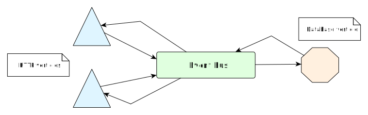

= Refactoring into independent and reusable verticles

TIP: The corresponding source code is in the `step-2` folder of the guide repository.

The first iteration got us a working wiki application.
Still, its implementation suffers from the following issues:

1. HTTP requests processing and database access code are interleaved within the same methods, and
2. lots of configuration data (e.g., port numbers, JDBC driver, etc) are hard-coded strings in the code.

== Architecture and technical choices

This second iteration is about refactoring the code into independent and reusable verticles:

We will deploy 2 verticles to deal with HTTP requests, and 1 verticle for encapsulating persistence through the database.
The 2 resulting verticles will not have direct references to each other as they will only agree on destination names in the event bus as well as message formats.
This provides a simple yet effective decoupling.

The messages sent on the event bus will be encoded in JSON.
While Vert.x supports flexible serialization schemes on the event bus for demanding or highly-specific contexts, it is generally a wise choice to go with JSON data.
Another advantage of using JSON is that it is a language-agnostic text format.
As Vert.x is _polyglot_, JSON is ideal shall verticles written in different languages need to communicate via message passing.

== The HTTP server verticle

The verticle class preamble and `start` method look as follows:

[source,java,indent=0]
----
include::src/main/java/io/vertx/guides/wiki/HttpServerVerticle.java[tags=start]
----
<1> We expose public constants for the verticle configuration parameters: the HTTP port number and the name of the event bus destination to post messages to the database verticle.
<2> The `AbstractVerticle#config()` method allows accessing the verticle configuration that has been provided. The second parameter is a default value in case no specific value was given.
<3> Configuration values can not just be `String` objects but also integers, boolean values, complex JSON data, etc.

The rest of the class is mostly an extract of the HTTP-only code, with what was previously database code being replaced with event bus messages.
Here is the `indexHandler` method code:

[source,java,indent=0]
----
include::src/main/java/io/vertx/guides/wiki/HttpServerVerticle.java[tags=indexHandler]
----
<1> The `vertx` object gives access to the event bus, and we send a message to queue for the database vertice.
<2> Delivery options allow us to specify headers, payload codecs and timeouts.
<3> Upon success a reply contains a payload.

As we can see, an event bus message consists of a body, options, and it can optionally expect a reply.
In the event that no response is expected there is a variant of the `send` method does not have a handler.

We encode payloads as JSON objects, and we specify which action the database verticle should do through a message header called `action`.

The rest of the verticle code consists in the router handlers that also use the event-bus to fetch and store data:

[source,java,indent=0]
----
include::src/main/java/io/vertx/guides/wiki/HttpServerVerticle.java[tags=rest]
----

== The database verticle

Connecting to a database using JDBC requires of course a driver and configuration, which we had hard-coded in the first iteration.
While this verticle will turn them to configuration parameters, we will also go a step further by loading the SQL queries from a properties file.
The queries will be loaded from a file passed as a configuration parameter or from a default resource if none is being provided.
The advantage of this approach is that the verticle can adapt both to different JDBC drivers _and_ SQL dialects.

The verticle class preamble consists mainly of configuration key definitions:

[source,java,indent=0]
----
include::src/main/java/io/vertx/guides/wiki/WikiDatabaseVerticle.java[tags=preamble]
----

SQL queries are being stored in a properties file, with the default ones for HSQLDB being located in `src/main/resources/db-queries.properties`:

----
include::src/main/resources/db-queries.properties[tags=queries]
----

The following code from the `WikiDatabaseVerticle` class load the SQL queries from a file, and make them available from a map:

[source,java,indent=0]
----
include::src/main/java/io/vertx/guides/wiki/WikiDatabaseVerticle.java[tags=loadSqlQueries]
----

We use the `SqlQuery` enumeration type to avoid string constants later in the code.
The code of the verticle `start` method is the following:

[source,java,indent=0]
----
include::src/main/java/io/vertx/guides/wiki/WikiDatabaseVerticle.java[tags=start]
----
<1> Interestingly we break an important principle in Vert.x which is to avoid blocking APIs, but since there are no asynchronous APIs for accessing resources on the classpath our options are limited. We could use the Vert.x `executeBlocking` method to offload the blocking I/O operations from the event loop to a worker thread, but since the data is very small there is no obvious benefit in doing so.
<2> Here is an example of using SQL queries.
<3> The `consumer` method registers an event bus destination handler.

The event bus message handler is the `onMessage` method:

[source,java,indent=0]
----
include::src/main/java/io/vertx/guides/wiki/WikiDatabaseVerticle.java[tags=onMessage]
----

We defined a `ErrorCodes` enumeration for errors, which we use to report back to the message sender.
To do so, the `fail` method of the `Message` class provides a convenient shortcut to reply with an error, and the original message sender gets a failed `AsyncResult`.

The rest of the class consists of private methods called when `onMessage` dispatches incoming messages:

[source,java,indent=0]
----
include::src/main/java/io/vertx/guides/wiki/WikiDatabaseVerticle.java[tags=rest]
----

== Deploying the verticles from a main verticle

We still have a `MainVerticle` class, but instead of containing all the business logic like in the initial iteration, its sole purpose is to bootstrap the application and deploy other verticles.

The code consists in deploying 1 instance of `WikiDatabaseVerticle` and 2 instances of `HttpServerVerticle` :

[source,java,indent=0]
----
include::src/main/java/io/vertx/guides/wiki/MainVerticle.java[tags=main]
----
<1> Deploying a verticle is an asynchronous operation, so we need a `Future` for that. The `String` parametric type is because a verticle gets an identifier when successfully deployed.
<2> One option is to create a verticle instance with `new`, and pass the object reference to the `deploy` method. The `completer` return value is a handler that simply completes its future.
<3> Sequential composition with `compose` allows to run one asynchronous operation after the other. When the initial future completes successfully, the composition function is invoked.
<4> A class name as a string is also an option to specify a verticle to deploy. For other JVM languages string-based conventions allow a module / script to be specified.
<5> The `DeploymentOption` class allows to specify a number of parameters and especially the number of instances to deploy.
<6> The composition function returns the next future. Its completion will trigger the completion of the composite operation.
<7> We define a handler that eventually completes the `MainVerticle` start future.

The astute reader will probably wonder how we can deploy the code for a HTTP server on the same TCP port twice and not expect any error for either of the instances, since the TCP port will already be in use.
With many web framework we would need to choose different TCP ports, and have a frontal HTTP proxy to perform load balancing between the ports.

There is no need to do that with Vert.x as multiple verticles can share the same TCP ports.
Incoming connections are simply distributed in a round-robin fashion.
