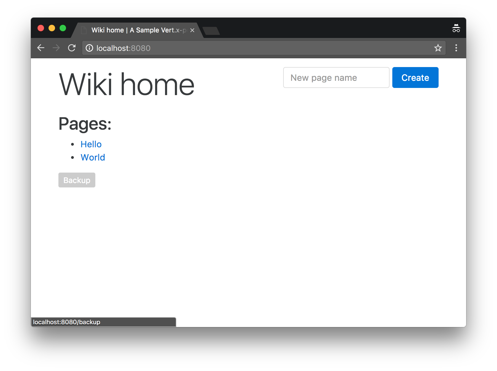
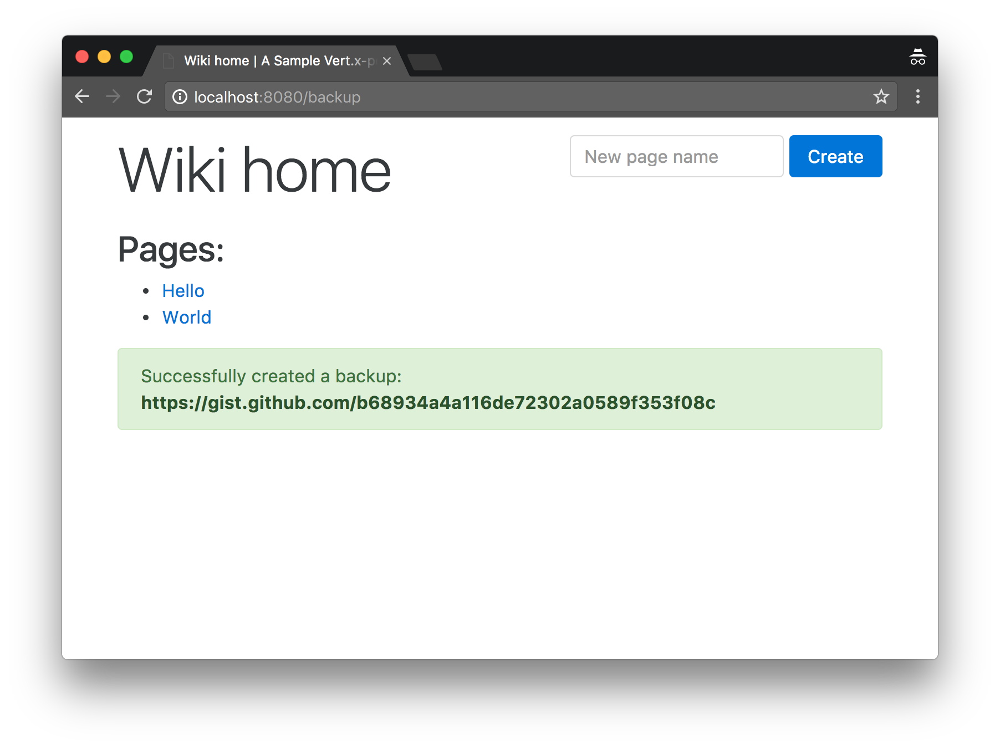
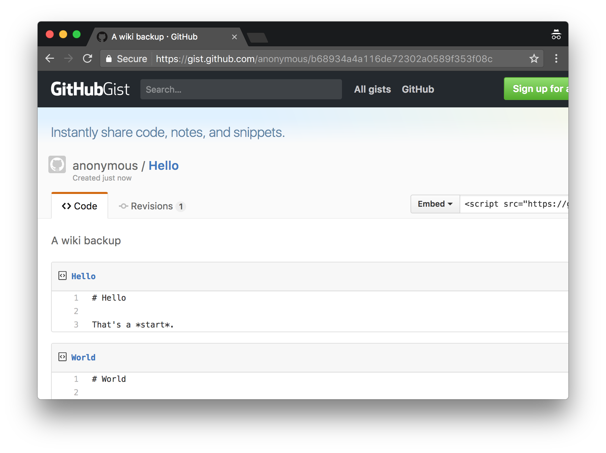

= Integrating with a 3rd-party web service

TIP: The corresponding source code is in the `step-5` folder of the guide repository.

Modern applications rarely live on a separated island as they need to integrate with other (distributed) application and services.
Integration is very often achieved using APIs exposed over the versatile HTTP protocol.

This section shows how to integrate with a 3rd-party web service using the HTTP client APIs of Vert.x.

== Scenario: backing up to GitHub Gist

The https://gist.github.com/[GitHub Gist service] is popular for sharing code snippets to the world.
Other services can use it, an example being the https://medium.com[Medium publishing platform] where links to Gists allow code snippets to be embedded inside publications.

GitHub exposes a https://developer.github.com/v3/[detailed API] for fetching, creating, updating and deleting Gists.
The API uses HTTPS endpoints starting at https://api.github.com/ and JSON payloads.

While many operations require authorization from the client using OAuth authentication, https://developer.github.com/v3/gists/#create-a-gist[creating a Gist is possible while being anonymous].
We are going to leverage this feature to backup our wiki pages as Gists.

A new button is going to be added on the wiki index page:

Cliking the _backup_ button will trigger the creating of a Gist:

A backup Gist consists of 1 file per wiki page, with the content being the raw Markdown text:

== The web client API

The Vert.x core library offers a `createHttpClient` method from the `vertx` context object.
Instances of `io.vertx.core.http.HttpClient` provides low-level methods for doing all kinds of HTTP requests with a fine-grained control over the protocol and the stream events.

The web client API provides a simpler facade, especially for simplifying the payload data (un)marshalling.
This API comes in the form of a new dependency:

[source,xml]
----
<dependency>
  <groupId>io.vertx</groupId>
  <artifactId>vertx-web-client</artifactId>
  <version>${vertx.version}</version>
</dependency>
----

The following is a sample usage from a unit test.
The test starts a HTTP server and then it does a HTTP GET request with the web client API to check that the request to the server suceeded:

[source,java,indent=0]
----
include::src/test/java/io/vertx/guides/wiki/http/SampleHttpServerTest.java[tags=client]
----

== Creating anonymous Gists

We first need a web client object to issue HTTP requests to the Gist API:

[source,java,indent=0]
----
include::src/main/java/io/vertx/guides/wiki/http/HttpServerVerticle.java[tags=webClient]
----

TIP: Since requests are made using HTTPS, we need to configure the web client with SSL support.

TIP: The GitHub API requires a valid `User-Agent` header and requests a GitHub account or organization identifier.
We override the default user agent with `vert-x3` but you may opt to use your own value instead.

We then modify the web router configuration in the `HttpServerVerticle` class to add a new route for triggering backups:

[source,java]
----
router.get("/backup").handler(this::backupHandler);
----

The code for this handler is the following:

[source,java,indent=0]
----
include::src/main/java/io/vertx/guides/wiki/http/HttpServerVerticle.java[tags=backupHandler]
----
<1> The Gist creation request payload is a JSON document as outlined in the https://developer.github.com/v3/gists/#create-a-gist[GitHub API documentation].
<2> Each file is an entry under the `files` object of the payload, where the title is the key and the value is the text.
<3> The web client needs to issue a `POST` request on port 443 (HTTPS), and the path must be `/gists`.
<4> It is mandatory to have a `Accept` header in the request with the `application/vnd.github.v3+json` MIME type, otherwise the request fails. It is also important to specify that the payload is a JSON object at the next line.
<5> The `BodyCodec` class provides a helper to specify that the response will be directly converted to a Vert.x `JsonObject` instance. It is also possible to use `BodyCodec#json(Class<T>)` and the JSON data will be mapped to a Java object of type `T` (this uses Jackson data mapping under the hood).
<6> `sendJsonObject` is a helper for triggering the HTTP request with a JSON payload.
<7> Upon success we can traverse the JSON data (`html_url` key) to get the user-friendly URL of the newly created Gist.
