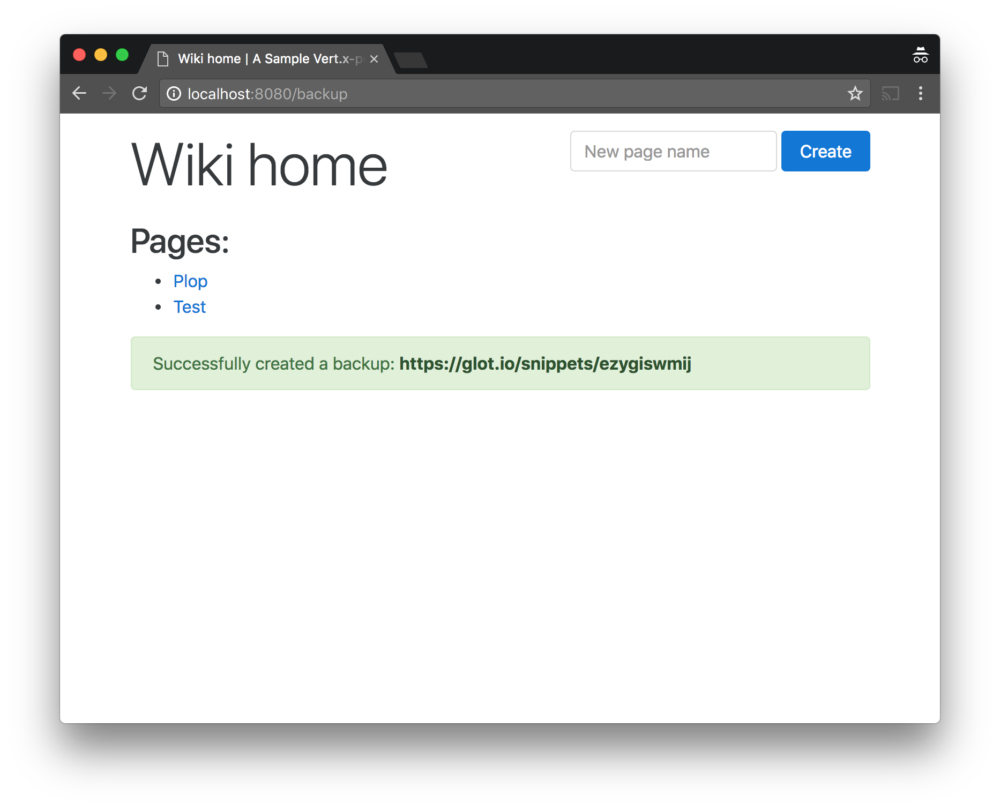
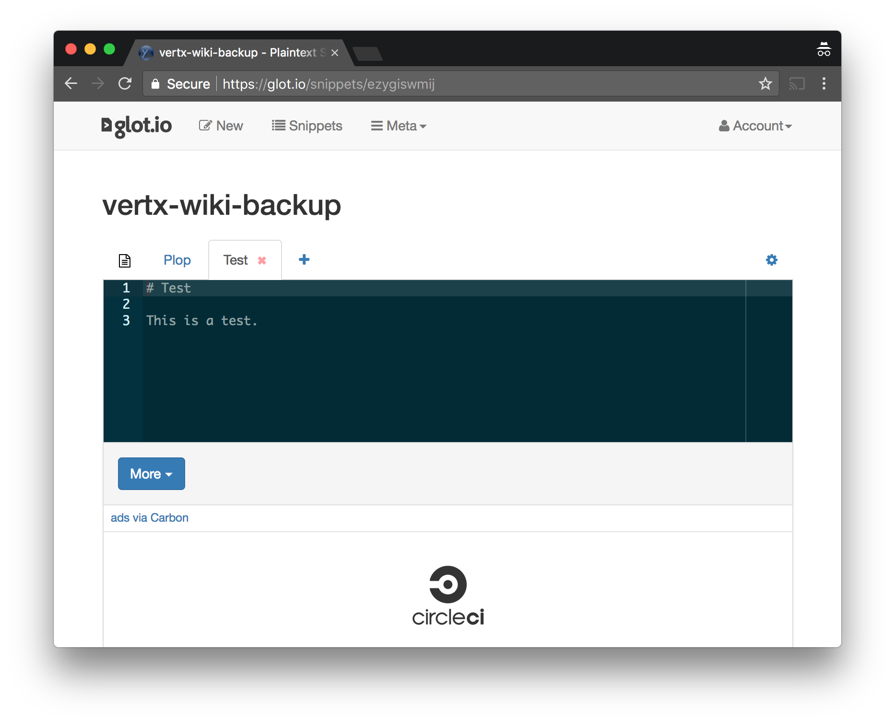

= Integrating with a 3rd-party web service

TIP: The corresponding source code is in the `step-5` folder of the guide repository.

Modern applications rarely live on a separated island as they need to integrate with other (distributed) application and services.
Integration is very often achieved using APIs exposed over the versatile HTTP protocol.

This section shows how to integrate with a 3rd-party web service using the HTTP client APIs of Vert.x.

== Scenario: backing up to Glot.io

The https://glot.io/[Glot service] allows sharing code snippets and files to the world.
It exposes an https://github.com/prasmussen/glot-snippets/blob/master/api_docs/create_snippet.md[API for posting anonymous snippets].

We are going to leverage this service to backup our wiki pages as snippets where each file represents the Markdown content of a wiki page.

A new button is going to be added on the wiki index page:

image::images/backup-button.png[]

Clicking the _backup_ button will trigger the creation of a snippet:

Each backup snippet can then be seen at Glot.io:

== Updating the database service

Before we dive into the web client API and perform HTTP requests to another service, we need to update the database service API to fetch all the wiki pages data in one pass.
This corresponds to the following SQL query to add to `db-queries.properties`:

    all-pages-data=select * from Pages

A new method is added to the `WikiDatabaseService` interface:

[source,java,indent=0]
----
include::src/main/java/io/vertx/guides/wiki/database/WikiDatabaseService.java[tags=fetchAllPagesData]
----

The implementation in `WikiDatabaseServiceImpl` is the following:

[source,java,indent=0]
----
include::src/main/java/io/vertx/guides/wiki/database/WikiDatabaseServiceImpl.java[tags=fetchAllPagesData]
----

== The web client API

The Vert.x core library offers a `createHttpClient` method from the `vertx` context object.
Instances of `io.vertx.core.http.HttpClient` provides low-level methods for doing all kinds of HTTP requests with a fine-grained control over the protocol and the stream of events.

The web client API provides a simpler facade, especially for simplifying the payload data (un)marshaling.
This API comes in the form of a new dependency:

[source,xml]
----
<dependency>
  <groupId>io.vertx</groupId>
  <artifactId>vertx-web-client</artifactId>
  <version>${vertx.version}</version>
</dependency>
----

The following is a sample usage from a unit test.
The test starts a HTTP server and then it does a HTTP GET request with the web client API to check that the request to the server succeeded:

[source,java,indent=0]
----
include::src/test/java/io/vertx/guides/wiki/http/SampleHttpServerTest.java[tags=client]
----

== Creating anonymous snippets

We first need a web client object to issue HTTP requests to the Gist API:

[source,java,indent=0]
----
include::src/main/java/io/vertx/guides/wiki/http/HttpServerVerticle.java[tags=webClient]
----

TIP: Since requests are made using HTTPS, we need to configure the web client with SSL support.

TIP: We override the default user agent with `vert-x3` but you may opt to use your own value instead.

We then modify the web router configuration in the `HttpServerVerticle` class to add a new route for triggering backups:

[source,java]
----
router.get("/backup").handler(this::backupHandler);
----

The code for this handler is the following:

[source,java,indent=0]
----
include::src/main/java/io/vertx/guides/wiki/http/HttpServerVerticle.java[tags=backupHandler]
----
<1> The snippet creation request payload is a JSON document as outlined in the https://github.com/prasmussen/glot-snippets/blob/master/api_docs/create_snippet.md[service API documentation].
<2> Each file is an entry under the `files` object of the payload, with a title and content.
<3> The web client needs to issue a `POST` request on port 443 (HTTPS), and the path must be `/snippets`.
<4> The `BodyCodec` class provides a helper to specify that the response will be directly converted to a Vert.x `JsonObject` instance. It is also possible to use `BodyCodec#json(Class<T>)` and the JSON data will be mapped to a Java object of type `T` (this uses Jackson data mapping under the hood).
<5> `sendJsonObject` is a helper for triggering the HTTP request with a JSON payload.
<6> Upon success we can get the snippet identifier, and construct a URL to the user-friendly web representation.

Finally, we update the `index.ftl` template to include a button to trigger the backup and display the URL we constructed.

[source,html]
----
include::src/main/resources/templates/index.ftl[]
----
 