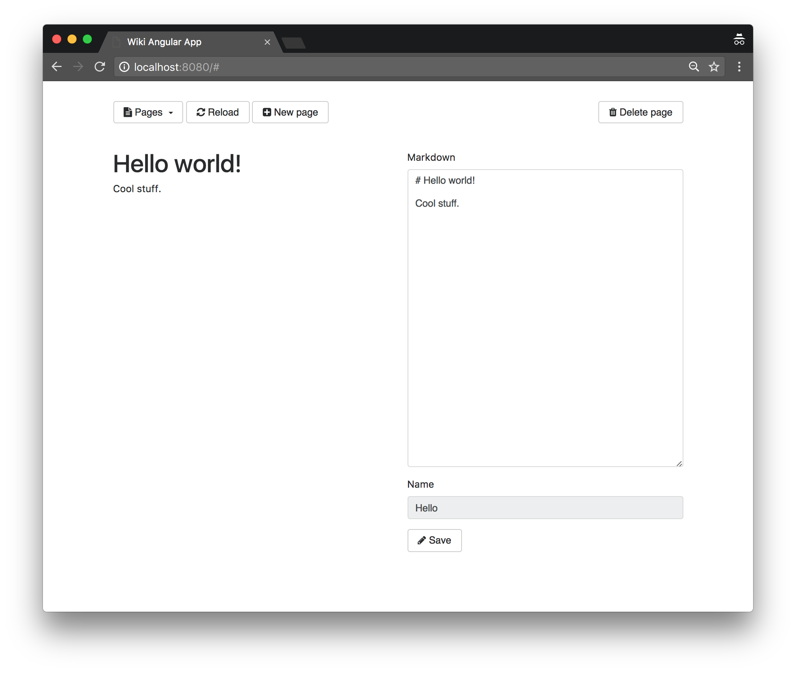
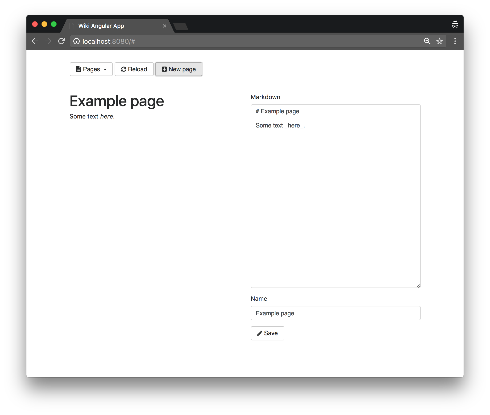

= Client-side web application using AngularJS 

TIP: The corresponding source code is in the `step-9` folder of the guide repository.

So far our web interface was using traditional server-side rendering of HTML content.
Some types of applications can take advantage of client-side rendering to improve user experience by avoiding full page reloads, and approaching the experience of native applications.

Many popular frameworks exist for that purpose.
We chose the popular http://angularjs.org/[AngularJS framework] for this guide, but one could equally choose https://facebook.github.io/react/[React], https://vuejs.org/[Vue.js], http://riotjs.com/[Riot] or another framework/library without any loss of generality.

== Single page application

The wiki editing application that we are building allows to select a page, and edit it with the first half of the screen being a HTML preview, and the other half being the Markdown editor:

The HTML preview is being rendered by calling a new endpoint in our backend.
Rendering is triggered when the Markdown editor text changes.
To avoid overloading the backend with unecessary requests when the user is busy typing Markdown, a delay is being introduced so as to only trigger the rendering when no change has been made during that delay.

The application interface is also dynamic, as new pages make the deletion button disapear:

== Vert.x Backend

=== Simplifying the HTTP verticle code

A client-side application needs a backend that exposes:

1. the static HTML, CSS and JavaScript content to bootstrap applications in web browsers, and
2. a web API, typically a HTTP/JSON service.

We simplified the HTTP verticle implementation to _just_ cover what is needed.
Starting fron the RxJava version from _step #8_, we removed all server-side rendering code as well as the authentication and JWT token issuing code to expose a plain open HTTP interface.
Of course building a version that leverages JWT tokens and authentication makes sense for a real-world deployments, but we would rather focus on the essential bits in this guide.

As an example, the `apiUpdatePage` method implementation code is now:

[source,java,indent=0]
----
include::src/main/java/io/vertx/guides/wiki/http/HttpServerVerticle.java[tags=apiUpdatePage]
----

=== Exposed routes

The HTTP/JSON API is exposed through the sames routes as in the previous steps:

[source,java,indent=0]
----
include::src/main/java/io/vertx/guides/wiki/http/HttpServerVerticle.java[tags=routes]
----

The front application static assets are being served from `/app`, and we redirect requests to `/` to the `/app/index.html` static file:

[source,java,indent=0]
----
include::src/main/java/io/vertx/guides/wiki/http/HttpServerVerticle.java[tags=static-assets]
----
<1> Disabling caching is useful in development.
<2> By default the files are expected to be in the `webroot` package on the _classpath_, so the files shall be placed under `src/main/resources/webroot` in a Maven or Gradle project.

Last but not least, we anticipate that the application will need the backend to render Markdown to HTML, so we offer a HTTP POST endpoint for this purpose:

[source,java,indent=0]
----
include::src/main/java/io/vertx/guides/wiki/http/HttpServerVerticle.java[tags=preview-rendering]
----

== AngularJS frontend

TIP: This guide is not a proper introduction to AngularJS (https://docs.angularjs.org/tutorial[see the official tutorial instead]), we assume some familiarity of the framework from the reader.

=== Application view

The interface fits in a single HTML file located at `src/main/resources/webroot/index.html`.
The `head` section is:

[source,html,indent=0]
----
include::src/main/resources/webroot/index.html[tags=head]
----
<1> The AngularJS module is named `wikiApp`.
<2> `wiki.js` holds the code for our AngularJS module and controller.

As you can see beyond AngularJS we are using the following dependencies from external CDNs:

* https://getbootstrap.com/[Boostrap] to style our interface,
* http://fontawesome.io/[Font Awesome] to provide icons,
* https://lodash.com/[Lodash] to help with some functional idioms in our JavaScript code.

Bootstrap requires some further scripts that can be loaded at the end of the document for performance reasons:

[source,html,indent=0]
----
include::src/main/resources/webroot/index.html[tags=bottom]
----

Our controller is called `WikiController` and it is bound to a `div` which is also a Bootstrap container:

[source,html,indent=0]
----
include::src/main/resources/webroot/index.html[tags=container]
----

The buttons on top of the interface consist of the following elements:

[source,html,indent=0]
----
include::src/main/resources/webroot/index.html[tags=buttons-row]
----
<1> For each wiki page name we generate an element using `ng-repeat` and `ng-click` to define the controller action (`load`) when it is being clicked.
<2> The refresh button is bound to the `reload` controller action. All other buttons work the same way.
<3> The `ng-show` directive allows us to show or hide the element depending on the controller `pageExists` method value.
<4> This `div` is used to display notifications of success or failures.

The Markdown preview and editor elements are the following:

[source,html,indent=0]
----
include::src/main/resources/webroot/index.html[tags=markdown]
----
<1> `ng-model` binds the `textarea` content to the `pageMarkdown` property of the controller.
